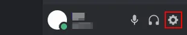
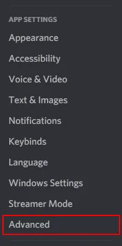
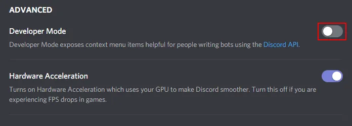
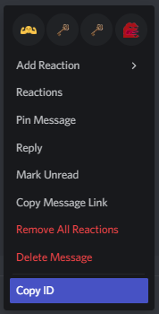

# Enabling Discord Developer Mode
!!! info 
    All administrative commands in BodgeBot require a **messagid** argument. In order to get this you will need to enable developer mode.
    
In Discord, click the ````Gear```` icon next to your name in the lower left corner.



Click ````Advanced```` under App Settings on the left hand side.



Developer Mode is the first option in the ````Advanced```` page. Click the ````Toggle```` icon next to it to enable developer mode.



After enabling developer mode, You should be able to see 'Copy ID' when right clicking a messages, users and any other object in discord.

