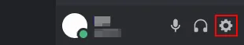
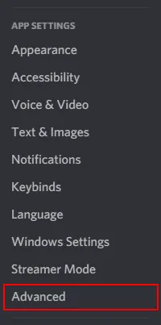
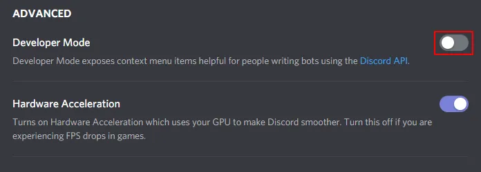
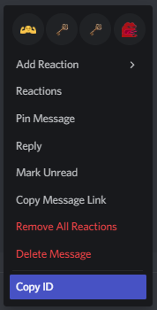

# EventAdmin Commands

## Enabling Developer Discord Mode
!!! info 
    All administrative commands in BodgeBot require a **messagid** argument. In order to get this you will need to enable developer mode.
    
In Discord, click the ````Gear```` icon next to your name in the lower left corner.



Click ````Advanced```` under App Settings on the left hand side.



Developer Mode is the first option in the ````Advanced```` page. Click the ````Toggle```` icon next to it to enable developer mode.



After enabling developer mode, You should be able to see 'Copy ID' when right clicking a message in discord.



## Command Usage

* `!eventadmin <sub-command> <arguments>` 

##### Sub-Command List
* `signin` - Manually Checks user/s into an event  
* `signout` - Manually Checks out user/s from an event
* `delete` - Deletes and Event
* `regen-message` - Regen's the event message (Should only be used if the bot bug's when sending a message)

* `cleanup-messages` - deletes any non-event messages in the chat.


##### Example

`!pledge normal 24/04/2021 17:00 Normal pledge run` 

Normal Pledge Run on the 24<sup>th</sup> April 2021 @ 17:00 with a description of "Normal pledge run"

